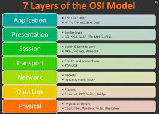
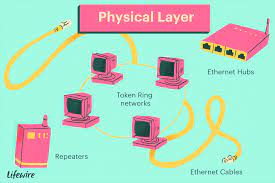
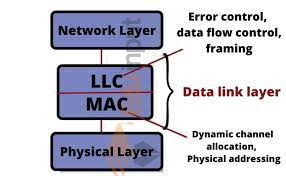
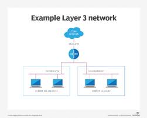
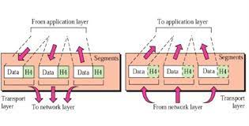
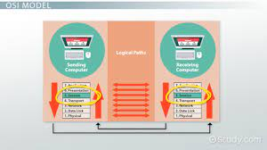
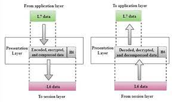
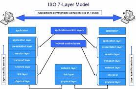

OSI (Open Systems Interconnection)

<strong>Gambar:</strong> OSI layer

OSI (Open Systems Interconnection) adalah sebuah model referensi yang digunakan untuk memahami dan menggambarkan bagaimana komunikasi jaringan komputer bekerja. Model OSI terdiri dari tujuh lapisan yang menyusun hierarki fungsional dari fungsi-fungsi yang diperlukan dalam komunikasi data. Setiap lapisan bertanggung jawab atas tugas-tugas tertentu dan bekerja bersama-sama untuk mengirimkan data dari satu perangkat ke perangkat lain dalam jaringan. Berikut adalah penjelasan lengkap mengenai masing-masing lapisan dalam model OSI:

1. Lapisan Fisik (Physical Layer):
 

<strong>Gambar:</strong> Physical

Lapisan ini bertanggung jawab untuk mengirimkan bit-bit mentah melalui media transmisi fisik seperti kabel, serat optik, atau gelombang radio. Fungsi utamanya adalah mengatur aspek fisik dari transmisi data, termasuk tipe kabel, tegangan sinyal, kecepatan transmisi, dan topologi jaringan.

2. Lapisan Data Link (Data Link Layer):
 

<strong>Gambar:</strong> Data Link

Lapisan ini bertanggung jawab untuk mengelola aliran data antara dua perangkat yang berdekatan dalam jaringan. Ini melibatkan deteksi dan koreksi kesalahan, pengaturan aliran data, dan pengalamatan fisik (MAC address).

3. Lapisan Jaringan (Network Layer):
 

<strong>Gambar:</strong> Network

Lapisan ini mengatur alamat logis (IP address) dan mengatur pengiriman data antar jaringan yang berbeda. Fungsi utamanya adalah pengalihan paket data dan pemilihan jalur terbaik untuk mengirimkan data dari sumber ke tujuan.

4. Lapisan Transport (Transport Layer):
 

<strong>Gambar:</strong> Transport

Lapisan ini bertanggung jawab untuk memastikan pengiriman data yang andal antara sumber dan tujuan. Ini mencakup pengaturan kesalahan, pengurutan, dan pengelompokan data dalam segmen-segmen.

5. Lapisan Sesi (Session Layer):
 

<strong>Gambar:</strong> Session

Lapisan ini memungkinkan dua aplikasi di berbagai perangkat untuk memulai, mengelola, dan mengakhiri sesi komunikasi. Ini mencakup pengaturan pembukaan, pemeliharaan, dan penutupan koneksi.

6. Lapisan Presentasi (Presentation Layer):
 

<strong>Gambar:</strong> Presentation

Lapisan ini mengelola konversi, kompresi, dan enkripsi data agar dapat diinterpretasikan oleh aplikasi penerima. Ini juga memastikan bahwa data yang dikirim memiliki format yang kompatibel.

7. Lapisan Aplikasi (Application Layer):
 

<strong>Gambar:</strong> Application

Lapisan teratas ini berinteraksi langsung dengan aplikasi pengguna. Ini menyediakan antarmuka untuk akses ke layanan jaringan seperti email, web browsing, dan transfer berkas.

Komunikasi protokol adalah serangkaian aturan dan norma yang mengatur pertukaran data antara perangkat dalam sebuah jaringan. Protokol dapat berkaitan dengan berbagai lapisan OSI. Contohnya, protokol HTTP (Hypertext Transfer Protocol) bekerja pada lapisan aplikasi untuk mengatur pertukaran data dalam web browsing, sementara protokol TCP (Transmission Control Protocol) bekerja pada lapisan transport untuk mengatur pengiriman data yang andal.

Ketika dua perangkat ingin berkomunikasi, mereka harus setuju pada protokol yang akan mereka gunakan dan mematuhi aturan yang terkandung dalam protokol tersebut. Model OSI dan protokol komunikasi memungkinkan perangkat dengan perangkat yang berbeda untuk berkomunikasi secara efisien dalam jaringan yang kompleks.