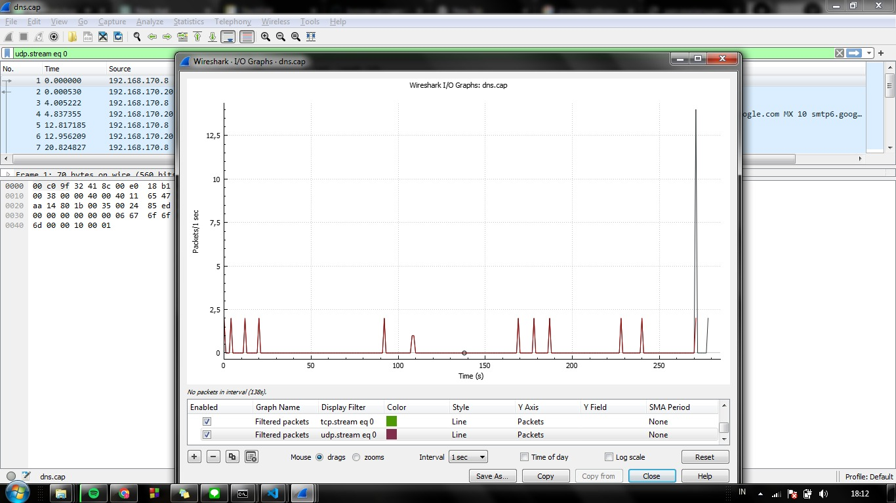

## DNS
**Pengenalan DN**
DNS (Domain Name System) adalah sistem yang digunakan dalam jaringan komputer untuk mengonversi nama domain yang mudah diingat menjadi alamat IP numerik yang diperlukan untuk mengidentifikasi perangkat dalam jaringan. DNS berperan penting dalam memfasilitasi komunikasi di internet karena manusia lebih mudah mengingat nama domain seperti "[www.example.com](http://www.example.com/)" daripada alamat IP numerik yang kompleks.

**Analisa dns.cap pada Wireshark**

**Header DNS** 
header dns adalah bagian dari pesan DNS yang mengandung informasi penting yang diperlukan untuk mengelola dan mengarahkan permintaan DNS. Setiap pesan DNS, baik permintaan (query) maupun respons, memiliki header yang terdiri dari beberapa bidang penting. Berikut adalah penjelasan singkat tentang beberapa bidang yang biasanya ditemukan dalam header DNS:

1.  **ID (Identifier)**: Ini adalah bilangan bulat acak yang digunakan untuk mengidentifikasi permintaan DNS yang sesuai dengan responsnya. ID ini membantu dalam pencocokan permintaan dan respons yang berpasangan.
    
2.  **QR (Query/Response Flag)**: Flag ini menunjukkan apakah pesan adalah permintaan (0) atau respons (1). Permintaan dikirim oleh klien untuk mencari alamat IP dari nama domain, sementara respons adalah jawaban yang berisi informasi tersebut.
    
3.  **Opcode (Operation Code)**: Field ini menunjukkan jenis operasi yang diminta atau dilakukan dalam pesan DNS. Contohnya adalah operasi standar (0) untuk mencari alamat IP, atau operasi lain yang dapat digunakan untuk berbagai keperluan.
    
4.  **AA (Authoritative Answer)**: Ini adalah flag yang menunjukkan apakah server DNS yang merespons adalah otoritatif, yaitu server yang memiliki informasi lengkap tentang nama domain yang dicari.
    
5.  **TC (Truncation Flag)**: Flag ini menandakan apakah pesan telah dipotong (truncated) karena terlalu besar untuk ditangani dalam satu pesan DNS. Ini sering terjadi dalam respons DNS yang berukuran besar.
    
6.  **RD (Recursion Desired)**: Flag ini menunjukkan apakah klien menginginkan server DNS untuk melakukan pencarian rekursif jika informasi tidak ditemukan dalam cache lokalnya. Biasanya, nilainya diatur menjadi 1 untuk permintaan klien.
    
7.  **RA (Recursion Available)**: Ini adalah flag yang menunjukkan apakah server DNS yang merespons mendukung pencarian rekursif. Jika diatur menjadi 1, itu berarti server DNS dapat melakukan pencarian rekursif jika diminta.

<strong>Gambar:</strong> Header DNS

**Data Payload DNS**
Data payload DNS adalah bagian dari pesan DNS yang berisi informasi yang spesifik untuk jenis permintaan DNS tertentu. Payload ini berisi detail yang berkaitan dengan permintaan atau respons DNS yang dikirimkan dalam pesan.

Untuk permintaan DNS (query), data payload biasanya berisi informasi seperti:

1.  **Nama Domain (Domain Name)**: Nama domain yang dicari, misalnya "[www.example.com](http://www.example.com/)".
    
2.  **Tipe Rekaman (Record Type)**: Jenis rekaman DNS yang diminta, seperti A (untuk alamat IP IPv4), AAAA (untuk alamat IP IPv6), MX (untuk catatan mail exchange), atau jenis lainnya.
    
3.  **Kelas Rekaman (Record Class)**: Kelas rekaman DNS, yang biasanya adalah IN (Internet), yang menunjukkan penggunaan dalam lingkungan internet.
    

Untuk respons DNS, data payload akan berisi informasi yang sesuai dengan jenis rekaman DNS yang diminta. Misalnya, jika permintaan adalah untuk tipe rekaman A, respons akan mencakup alamat IP yang terkait dengan nama domain yang dicari.

<strong>Gambar:</strong> Data Payload DNS

**I/O Graph DNS**
Grafik I/O DNS adalah visualisasi dari aktivitas input (I) dan output (O) dalam permintaan dan respons DNS selama suatu periode waktu. Grafik ini memungkinkan pemantauan aliran data DNS dari dan ke berbagai sumber dalam jaringan. Berikut adalah penjelasan singkat tentang apa yang mungkin Anda temukan dalam grafik I/O DNS:

1.  **Input (I)**: Ini mencakup permintaan DNS yang dikirimkan oleh komputer pengguna atau perangkat dalam jaringan untuk mencari alamat IP yang sesuai dengan nama domain tertentu. Permintaan ini bisa datang dari berbagai sumber di jaringan.
    
2.  **Output (O)**: Ini mencakup respons DNS yang dikirimkan oleh server DNS sebagai jawaban atas permintaan DNS yang masuk. Respons ini berisi informasi seperti alamat IP yang terkait dengan nama domain yang dicari.
    
3.  **Waktu (Time)**: Grafik I/O DNS biasanya menampilkan informasi selama periode waktu tertentu, seperti detik, menit, atau jam. Ini memungkinkan pemantauan aktivitas DNS dari waktu ke waktu.
    
4.  **Volume (Volume)**: Grafik dapat menunjukkan jumlah permintaan dan respons DNS yang dikirimkan atau diterima selama periode waktu tertentu. Ini membantu dalam memahami tingkat aktivitas DNS.

<strong>Gambar:</strong> I/O Graph DNS

