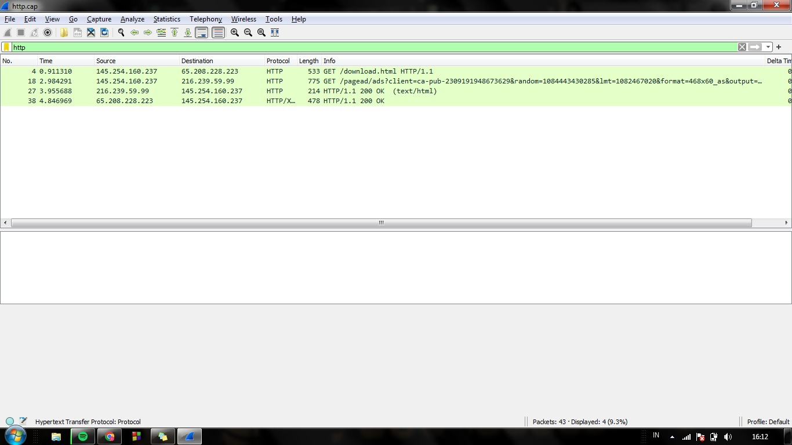
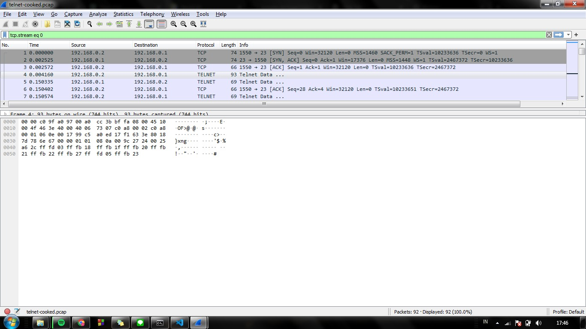
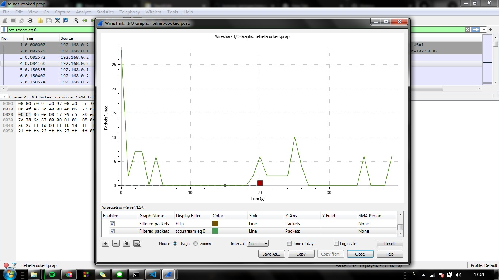

## HTTP
**Pengenalan Telnet**
Telnet adalah protokol jaringan yang digunakan untuk mengakses dan mengendalikan perangkat jarak jauh melalui jaringan komputer, seperti internet atau jaringan lokal. Ini memungkinkan pengguna untuk menjalankan perintah pada perangkat yang terhubung, seolah-olah mereka secara fisik ada di dekat perangkat tersebut.

**Analisa telnet-cooked.pcap pada Wireshark**

**Header Telnet** 
adalah bagian dari data yang dikirim dalam paket Telnet untuk mengatur dan mengontrol sesi Telnet antara dua perangkat atau komputer yang terhubung. Header ini berisi informasi yang diperlukan untuk mengelola koneksi Telnet. Berikut adalah beberapa informasi yang dapat ditemukan dalam header Telnet secara singkat:

1.  **Perintah Telnet (Telnet Command)**: Header Telnet mencakup perintah yang akan dieksekusi pada perangkat jarak jauh. Misalnya, perintah untuk login, logout, atau menjalankan perintah tertentu.
    
2.  **Opsi Telnet (Telnet Options)**: Header Telnet juga dapat berisi opsi yang mengatur perilaku koneksi Telnet. Contohnya, pengaturan karakter, pengiriman echo, atau pilihan lain yang dapat disesuaikan.
    
3.  **Data**: Header Telnet juga dapat berisi data yang dikirimkan atau diterima selama sesi Telnet, seperti perintah yang dimasukkan oleh pengguna atau keluaran dari perangkat jarak jauh.

<strong>Gambar:</strong> Header Telnet

**Data Payload Telnet**

Data payload Telnet adalah bagian dari paket Telnet yang mengandung informasi atau perintah yang dikirimkan dari komputer pengguna ke perangkat jarak jauh yang terhubung melalui Telnet. Payload ini berisi data aktual yang ingin dikirim atau perintah yang akan dieksekusi pada perangkat jarak jauh.

Contoh data payload Telnet bisa berupa:

1.  **Perintah**: Perintah yang diketikkan oleh pengguna dan dikirim ke perangkat jarak jauh. Misalnya, perintah untuk mengakses file, mengkonfigurasi perangkat, atau menjalankan program tertentu.
    
2.  **Input Pengguna**: Data yang dimasukkan oleh pengguna, seperti teks yang diketikkan atau perintah yang diberikan kepada perangkat jarak jauh.
    
3.  **Output Perangkat Jarak Jauh**: Data yang dikirimkan oleh perangkat jarak jauh sebagai respons terhadap perintah atau permintaan yang dikirimkan oleh pengguna. Ini bisa berupa teks, informasi konfigurasi, atau hasil operasi lainnya.

<strong>Gambar:</strong> Data Payload Telnet

**I/o Graph HTTP**

Grafik I/O dalam konteks Telnet biasanya merujuk pada representasi grafis atau visualisasi data masukan (I) dan keluaran (O) dari waktu ke waktu selama sesi Telnet. Grafik ini dapat memberikan wawasan tentang aliran data antara pengguna dan perangkat jarak jauh yang terhubung melalui Telnet. Berikut penjelasan singkat tentang apa yang mungkin Anda temukan dalam grafik I/O dalam sesi Telnet:

1.  **Masukan (I)**: Ini mewakili data atau perintah yang dikirim dari komputer pengguna ke perangkat jarak jauh melalui koneksi Telnet. Ini bisa mencakup masukan dari keyboard dan perintah yang diberikan oleh pengguna.
    
2.  **Keluaran (O)**: Ini mewakili data yang dikirimkan oleh perangkat jarak jauh sebagai respons terhadap masukan atau perintah yang dikirimkan oleh pengguna. Ini bisa berupa teks, informasi konfigurasi, atau hasil operasi lainnya.

<strong>Gambar:</strong> I/O Graph Telnet

