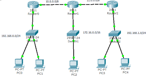

## **Judul: Dinamika Routing dalam Jaringan Komputer**

 

**Pendahuluan**

Dinamika routing adalah konsep dasar dalam jaringan komputer yang memungkinkan data berpindah dengan efisien melintasi jaringan perangkat yang saling terhubung. Berbeda dengan routing statis, di mana rute dikonfigurasi secara manual, protokol dinamika routing memungkinkan router dan switch untuk beradaptasi dengan perubahan kondisi jaringan dan secara otomatis memperbarui tabel routing. Esai ini akan menjelaskan konsep dinamika routing dalam jaringan komputer, pentingnya, dan bagaimana cara kerjanya.

**Memahami Dinamika Routing**

Dinamika routing adalah metode untuk menentukan jalur optimal bagi paket data untuk bergerak melalui jaringan secara dinamis. Dalam lingkungan dinamika routing, router berkomunikasi satu sama lain menggunakan protokol routing khusus. Protokol ini bertukar informasi tentang status jaringan dan mencapai kesepakatan tentang jalur terbaik untuk transmisi data. Berbeda dengan routing statis, di mana administrator secara manual mengkonfigurasi rute, dinamika routing memungkinkan jaringan beradaptasi dengan perubahan, seperti kegagalan koneksi atau perluasan jaringan, tanpa campur tangan manusia.

**Komponen Kunci Dinamika Routing:**

1. **Protokol Routing:** Dinamika routing bergantung pada protokol routing seperti RIP (Routing Information Protocol), OSPF (Open Shortest Path First), dan BGP (Border Gateway Protocol). Protokol ini mengatur cara router berbagi informasi, menghitung biaya jalur, dan membuat keputusan routing.

2. **Tabel Routing:** Setiap router memelihara tabel routing yang menyimpan informasi tentang jalur-jalur jaringan yang tersedia. Tabel ini terus diperbarui berdasarkan informasi yang diterima dari router tetangga. Tabel ini berisi entri yang menentukan jaringan tujuan, router berikutnya, dan biaya yang terkait dengan setiap rute.

3. **Algoritma Routing:** Protokol routing menggunakan algoritma untuk menentukan jalur terbaik ke tujuan. Algoritma ini mempertimbangkan faktor seperti jumlah hop, bandwidth, dan delay untuk memilih rute optimal.

**Keuntungan Dinamika Routing:**

1. **Kemampuan beradaptasi:** Dinamika routing menyesuaikan diri dengan perubahan topologi jaringan, menjadikannya ideal untuk jaringan yang besar dan kompleks. Ketika koneksi gagal atau segmen jaringan baru ditambahkan, protokol dinamika routing dengan cepat memperbarui tabel routing untuk memastikan pengiriman data yang efisien.

2. **Pengimbangan Beban:** Dinamika routing dapat mendistribusikan lalu lintas melalui beberapa jalur, mengoptimalkan kinerja jaringan dan mencegah kemacetan pada rute tertentu.

3. **Kemudahan Manajemen:** Dinamika routing mengurangi beban administrasi dengan mengotomatiskan pembaruan rute. Hal ini sangat menguntungkan dalam jaringan yang sering mengalami perubahan.

**Tantangan dan Pertimbangan:**

1. **Konsumsi Sumber Daya:** Protokol dinamika routing menggunakan sumber daya jaringan untuk pertukaran informasi dan perhitungan rute. Hal ini bisa menjadi masalah pada jaringan yang lebih kecil dengan bandwidth terbatas.

2. **Keamanan:** Dinamika routing membawa potensi risiko keamanan jika tidak dikonfigurasi dengan benar. Perangkat yang tidak sah dapat menyisipkan pembaruan routing palsu, menyebabkan penyadapan data atau pengalihan data.

3. **Kompleksitas:** Mengkonfigurasi dan menyelesaikan masalah protokol dinamika routing bisa lebih rumit daripada routing statis. Administrator jaringan perlu memahami mendalam protokol routing yang digunakan.

**Kesimpulan**

Dinamika routing memiliki peran penting dalam jaringan komputer modern dengan memungkinkan pemilihan jalur otomatis dan adaptif. Ini memberdayakan jaringan untuk berkembang, pulih dari kegagalan, dan mengoptimalkan aliran lalu lintas. Meskipun dinamika routing tidak cocok untuk setiap jaringan, ia menawarkan keuntungan signifikan jika diimplementasikan dengan baik, menjadikannya konsep penting dalam bidang jaringan komputer. Memahami bagaimana protokol dinamika routing bekerja dan dampaknya terhadap efisiensi jaringan penting bagi administrator dan insinyur jaringan.

