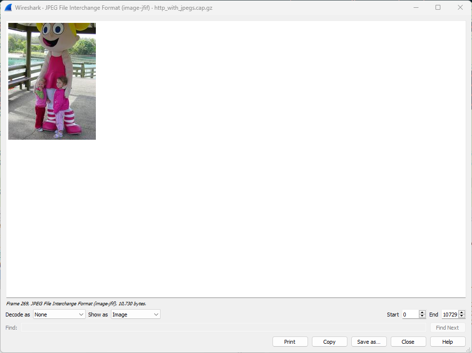

## Access Image Packet in HTTP
Mengakses paket gambar dalam HTTP mengacu pada menemukan dan mengekstrak gambar dari lalu lintas data HTTP dengan menggunakan alat seperti Wireshark. Ini memungkinkan untuk melihat, menyimpan, atau menganalisis gambar yang dikirim melalui protokol HTTP dalam paket data.
1. Bukalah berkas tangkapan contoh (sample capture) dengan nama "http_with_jpegs.cap" menggunakan aplikasi Wireshark, dan pastikan Anda mengatur filter tangkapan untuk hanya menampilkan lalu lintas HTTP.

2. Temukan paket yang menyertakan informasi "200 OK" dan juga merupakan gambar JPEG JFIF.

3. Klik pada paket tersebut, kemudian klik kanan pada format gambar JPEG File Interchange Format yang terdapat di jendela di bawah sebelah kiri. Selanjutnya, pilih opsi "Tampilkan Byte Paket" dengan mengkliknya, atau gunakan pintasan keyboard "CTRL + SHIFT + O."

4. Wireshark akan secara otomatis menampilkan konten gambar dari paket tersebut. Berikut adalah gambar contoh dari paket nomor 61.

5. Ada 5 paket yang berisi data gambar dalam berkas tangkapan tersebut. Berikut ini adalah 4 paket sisanya yang juga berisi data gambar.

