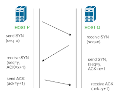

<strong>Gambar:</strong> Three way handshake

Three-way handshake adalah suatu proses yang digunakan dalam protokol komunikasi jaringan seperti TCP (Transmission Control Protocol) untuk memastikan bahwa koneksi antara dua perangkat berjalan dengan benar sebelum memulai pertukaran data. Tiga langkah yang terlibat dalam proses ini adalah:
**Langkah 1 - Permintaan Koneksi (SYN):**

1.  Klien ingin menginisiasi koneksi dengan server untuk bertukar data.
2.  Klien mengirimkan pesan SYN (Synchronize) kepada server.
3.  Pesan SYN ini berisi beberapa informasi penting:
    -   Nomor urutan (Sequence Number): Nomor acak yang digunakan oleh klien untuk mengidentifikasi setiap byte data dalam pertukaran.
    -   Ukuran jendela (Window Size): Jumlah maksimum byte yang dapat diterima oleh klien sekaligus.
4.  Klien juga menetapkan flag SYN dalam header pesan untuk menunjukkan bahwa ini adalah permintaan koneksi awal.

**Langkah 2 - Persetujuan Koneksi (SYN + ACK):**

1.  Server menerima pesan SYN dari klien.
2.  Server merespon dengan mengirimkan pesan SYN-ACK (Synchronize-Acknowledgment) kepada klien.
3.  Pesan SYN-ACK juga berisi informasi penting:
    -   Nomor urutan (Sequence Number): Nomor acak yang digunakan oleh server untuk mengidentifikasi setiap byte data dalam pertukaran. Nilai ini diambil dari nomor urutan yang diterima dari pesan SYN klien.
    -   Acknowledgment Number: Nomor urutan yang diterima dari pesan SYN klien ditambah satu, menunjukkan bahwa server telah menerima pesan SYN klien.
    -   Ukuran jendela: Jumlah maksimum byte yang dapat diterima oleh server sekaligus.
4.  Server menetapkan flag SYN dan ACK dalam header pesan untuk menunjukkan bahwa ini adalah tanggapan terhadap permintaan koneksi awal dari klien.

**Langkah 3 - Konfirmasi Koneksi (ACK):**

1.  Klien menerima pesan SYN-ACK dari server.
2.  Klien mengirimkan pesan ACK (Acknowledgment) kepada server sebagai konfirmasi bahwa pesan SYN-ACK telah diterima.
3.  Pesan ACK berisi Acknowledgment Number yang merupakan nomor urutan dari pesan SYN-ACK server ditambah satu. Ini menunjukkan bahwa klien telah menerima respon dari server.
4.  Klien juga dapat mulai mengirimkan data setelah mengirimkan pesan ACK, dan koneksi dianggap berhasil dibuat.

Dengan tiga langkah ini, klien dan server telah menginisiasi dan mengonfirmasi koneksi TCP yang saling dikenali. Ini memungkinkan pertukaran data yang andal antara kedua perangkat, dengan masing-masing tahu bahwa pihak lainnya siap untuk menerima data. Jika salah satu langkah dalam Three-way handshake tidak berhasil, maka koneksi tidak akan terbentuk dan perangkat akan mencoba lagi atau mengirimkan pesan kesalahan sesuai kebutuhan.