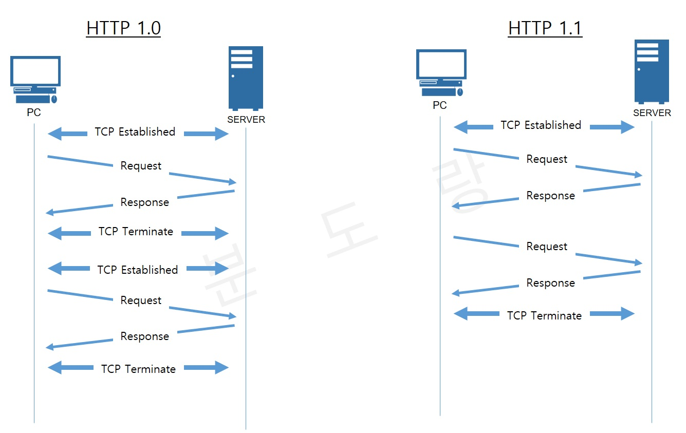
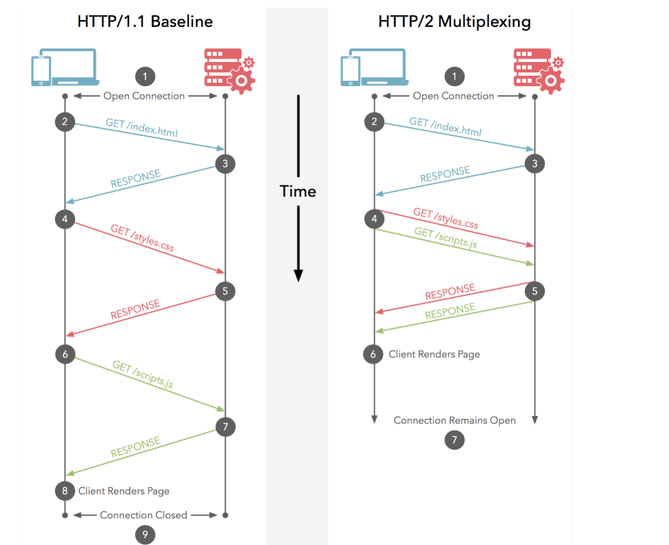

## Evolusi HTTP

Evolusi protokol HTTP (Hypertext Transfer Protocol) telah berlangsung selama beberapa dekade, dan telah mengalami banyak perubahan dan peningkatan sepanjang perjalanannya. Berikut adalah pandangan umum tentang evolusi HTTP dari awal hingga akhir:
	
 1.  **HTTP/0.9:**
 - HTTP pertama kali diperkenalkan oleh Tim Berners-Lee pada tahun 1989.   
 - Versi awal ini sangat sederhana dan hanya mendukung operasi dasar, seperti mengambil dokumen HTML.    
 - Tidak ada header HTTP, status code, atau metode HTTP yang didefinisikan.
 
 2. **HTTP/1.0:**
 

 - Versi 1.0 diperkenalkan pada tahun 1996 dan membawa perbaikan signifikan.
 - Mendukung header HTTP, status code, dan metode HTTP yang lebih lengkap.     
 - Komunikasi antara klien dan server masih bersifat non-persistent, yang berarti setiap permintaan HTTP baru memerlukan koneksi TCP yang baru.
 
 3.  **HTTP/1.1:**
 - HTTP/1.1 diperkenalkan pada tahun 1997 dan menjadi standar de facto selama lebih dari satu dekade.
 - Mendukung koneksi persisten (keep-alive) untuk mengurangi overhead koneksi TCP.
 - Memperkenalkan pipelining, yang memungkinkan klien mengirim beberapa permintaan tanpa menunggu respon pertama.
 - Memiliki beberapa masalah performa dan keamanan, terutama ketika digunakan dengan banyak permintaan sekuensial.

 4. **HTTP 2:**
  

 - HTTP/2 diperkenalkan pada tahun 2015 dan dirancang untuk meningkatkan kecepatan dan efisiensi komunikasi web.
-   Menggunakan multiplexing, yang memungkinkan banyak permintaan dan respon untuk dikirim dalam satu koneksi.
-   Mendukung kompresi header dan data untuk mengurangi penggunaan bandwidth.
-   Didesain agar lebih efisien daripada HTTP/1.1, terutama untuk aplikasi web yang kompleks.

5. **HTTP 3:**
  

-    
    HTTP/3, juga dikenal sebagai HTTP over QUIC (Quick UDP Internet Connections), adalah evolusi terbaru dari HTTP.
-   Diperkenalkan pada tahun 2020.
-   Menggantikan protokol TCP dengan UDP untuk mengurangi latency.
-   Memperkenalkan transport layer yang lebih aman dan cepat, serta pemisahan antara permintaan dan respon.
-   Menggunakan multiplexing seperti HTTP/2 tetapi dengan kinerja yang lebih baik.